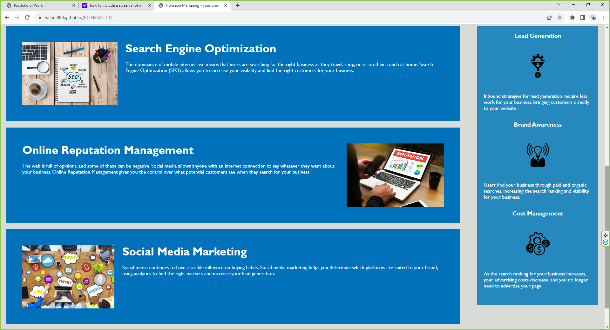

# Horiseon Marketing Webpage

## Description

This webpage was created for clients looking for help with search engine optimization, online reputation management, and social media marketing. The site was created with semantic HTML elements and followed a logical structure independent of styling and positioning. The icon and image elements were updated with alt attributes for accessibility. The heading attributes also structured in a sequential order.

## Installation

N/A

## Usage

To use this Marketing Webpage, you can click on the links on the page to learn about search engine optimization, online reputation management, and social media marketing. Also, if you scroll down the sidebar, you can learn about Lead Generation, Brand Awareness, and Cost Management.

## Credits

N/A

## License

Please refer to the LICENSE in the repo.

## Screen Shot

